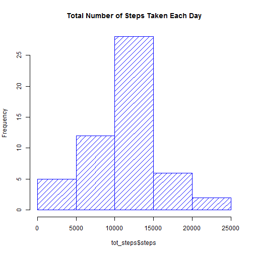
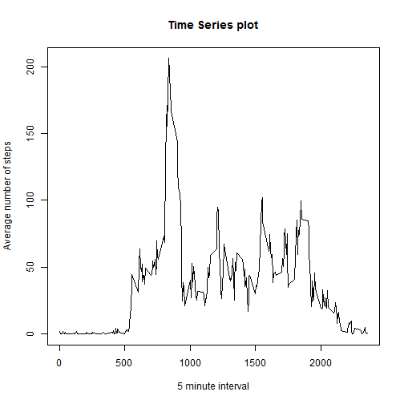
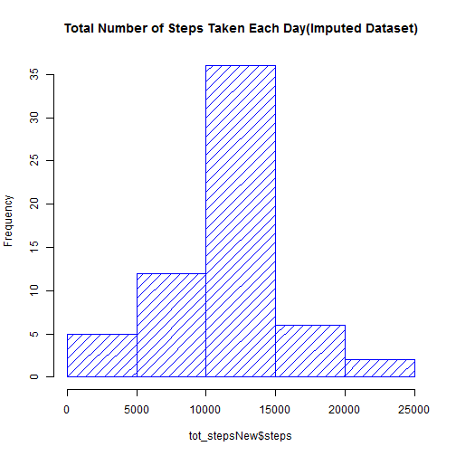
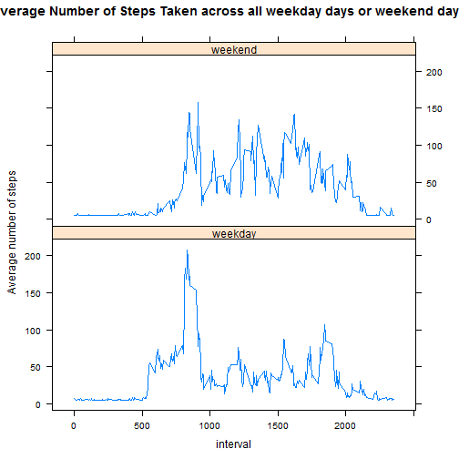

Required package:

```r
library(Hmisc)
```

###Loading and preprocessing the data


```r
if(!file.exists('activity.csv')){
    unzip('activity.zip')
}
activity_data<-read.csv("activity.csv")
head(activity_data)
```

```
##   steps       date interval
## 1    NA 2012-10-01        0
## 2    NA 2012-10-01        5
## 3    NA 2012-10-01       10
## 4    NA 2012-10-01       15
## 5    NA 2012-10-01       20
## 6    NA 2012-10-01       25
```

Transform variable **date** from class factor to class date


```r
activity_data$date <- as.Date(activity_data$date, format = "%Y-%m-%d")
```

###What is mean total number of steps taken per day?

Calculate the total no of steps each day(ignoring the missing values):


```r
tot_steps= aggregate(steps~date, data = activity_data, sum, na.rm=TRUE)
```

**Make a histogram of the total number of steps taken each day:**

```r
hist(tot_steps$steps,main = "Total Number of Steps Taken Each Day", density = 10,col="blue")
```


**Calculate the mean and the median of the total number of steps taken per day:**

```r
mean(tot_steps$steps)
```

```
## [1] 10766.19
```


```r
median(tot_steps$steps)
```

```
## [1] 10765
```

###What is the average daily activity pattern?

**Make a time series plot (i.e. type = "l") of the 5-minute interval (x-axis) and the average number of steps taken, averaged across all days (y-axis):**

```r
avg_step <- aggregate(steps ~ interval, data = activity_data, mean, na.rm = TRUE)
plot(avg_step$interval, avg_step$steps, type = "l",main = "Time Series plot",xlab = "5 minute interval", ylab = "Average number of steps")
```



**Which 5-minute interval, on average across all the days in the dataset, contains the maximum number of steps?**

```r
avg_step$interval[which.max(avg_step$steps)]
```

```
## [1] 835
```

###Imputing missing values

**Calculate and report the total number of missing values in the dataset**

```r
sum(is.na(activity_data))
```

```
## [1] 2304
```

**Devise a strategy for filling in all of the missing values in the dataset. The strategy does not need to be sophisticated. For example, you could use the mean/median for that day, or the mean for that 5-minute interval, etc.**

Create a new dataset that is equal to the original dataset but with the missing data filled in with the mean of 5-minute interval:

```r
activityDataImputed <- activity_data
activityDataImputed$steps <- impute(activity_data$steps, mean)
head(activityDataImputed)
```

```
##     steps       date interval
## 1 37.3826 2012-10-01        0
## 2 37.3826 2012-10-01        5
## 3 37.3826 2012-10-01       10
## 4 37.3826 2012-10-01       15
## 5 37.3826 2012-10-01       20
## 6 37.3826 2012-10-01       25
```

**Make a histogram of the total number of steps taken each day and Calculate and report the mean and median total number of steps taken per day. Do these values differ from the estimates from the first part of the assignment? What is the impact of imputing missing data on the estimates of the total daily number of steps?**

Make a histogram:

```r
tot_stepsNew= aggregate(steps~date, data = activityDataImputed, sum, na.rm=TRUE)
hist(tot_stepsNew$steps,main = "Total Number of Steps Taken Each Day(Imputed Dataset)", density = 10,col="blue")
```



Calculate the mean and the median:

```r
mean(tot_stepsNew$steps)
```

```
## [1] 10766.19
```


```r
median(tot_stepsNew$steps)
```

```
## [1] 10766.19
```

As per the outcomes the mean of the imputed dataset is the same as the mean of the original dataset. Although, the value of median obtained from the two datasets are not the same but they are nearly equal. The value of mean and median in the second dataset is the same.

###Are there differences in activity patterns between weekdays and weekends?

**Create a new factor variable in the dataset with two levels - "weekday" and "weekend" indicating whether a given date is a weekday or weekend day.**

```r
activityDataImputed$day <- weekdays(activityDataImputed$date)
activityDataImputed$week <- ""
activityDataImputed[activityDataImputed$day == "Saturday" | activityDataImputed$day == "Sunday", ]$week <- "weekend"
activityDataImputed[!(activityDataImputed$day == "Saturday" | activityDataImputed$day == "Sunday"), ]$week <- "weekday"
activityDataImputed$week <- factor(activityDataImputed$week)
```

**Make a panel plot containing a time series plot (i.e. type = "l") of the 5-minute interval (x-axis) and the average number of steps taken, averaged across all weekday days or weekend days (y-axis).**

```r
avg_stepNew <- aggregate(steps ~ interval + week, data = activityDataImputed, mean)

xyplot(steps ~ interval | week, data = avg_stepNew, type = "l", main = "Average Number of Steps Taken across all weekday days or weekend days", layout = c(1, 2), xlab = "interval", ylab = "Average number of steps")
```


